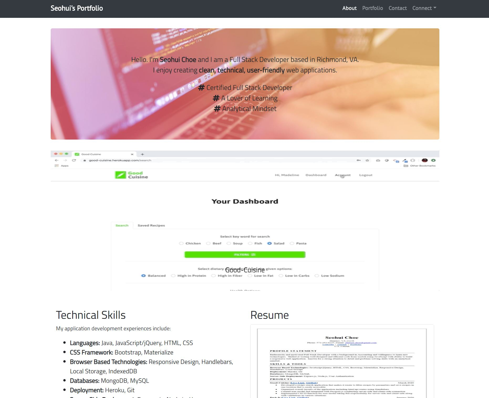
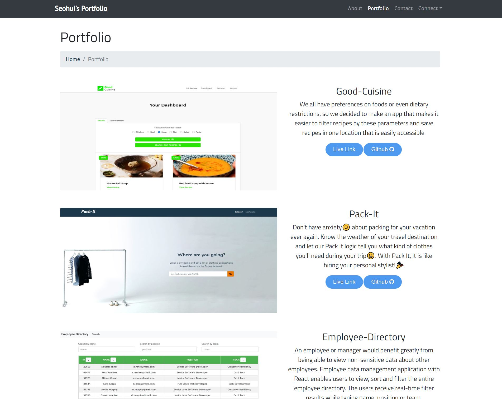

# React-Portfolio
Welcome to my portfolio website!  
It is showcase of my hard work :sparkles: and myself :raising_hand: as a Full Stack Developer.  
Enjoy clean, user-friendly and even fully mobile-responsive application! :+1:

# Screenshots

# Tech/framework used
* Programming Languages: JavaScript, HTML, CSS
* CSS Framework: Bootstrap
* Browser Based Technologies: Responsive Design, Font Awesome
* Deployment: Heroku, Git, Node.js
* Library/Package: React
* Other tools: Visual Studio Code

# Live link
* [Seohui's React Portfolio](https://cherry-crumble-93839.herokuapp.com/) :raising_hand_woman:
